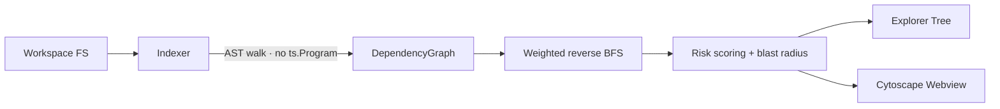

# VS Code Engineering Portfolio

> A working fork of [microsoft/vscode](https://github.com/microsoft/vscode) that hosts two independent engineering tracks:
> a maintainer-friendly OSS contribution to the VS Code integrated terminal, and **ImpactFlow** — a from-scratch
> architectural impact-analysis extension built on the TypeScript compiler API.

The upstream Visual Studio Code README is preserved verbatim as [VSCODE_README.md](./VSCODE_README.md).

---

## Why this fork exists

This repository is a deliberate, long-form demonstration of:

- **OSS contribution discipline.** Designing a change that a maintainer would actually merge: narrow scope, pure helper module, exhaustive tests, opt-in by default, review-friendly commit series.
- **Developer tooling architecture.** Building a non-trivial static-analysis system from the compiler API up through a theme-aware interactive visualization.
- **Systems thinking.** Picking algorithms (weighted reverse BFS with geometric decay) and data structures (directed adjacency lists with forward + reverse indices, typed edges) that answer the user's question directly instead of bolting on ad-hoc heuristics.
- **Engineering communication.** Module-level doc comments, explicit design-tradeoff tables, commit messages that explain *why*, and README diagrams that a reviewer can read in five minutes.

Both tracks are fully self-contained, fully pushed, and can be evaluated in isolation.

---

## See it run in 10 seconds (no setup)

Two self-contained HTML demos live in [`demo/`](./demo). Open either file in a browser:

- [**`demo/track1-terminal-risk-preview.html`**](./demo/track1-terminal-risk-preview.html) — the real command-risk detector ported to browser JS, with a VS Code-styled confirmation dialog. Type any command, or click a preset, to see the behavior exactly as it fires inside the terminal.
- [**`demo/track2-impactflow.html`**](./demo/track2-impactflow.html) — a full interactive Cytoscape graph of a sample impact analysis with real ImpactFlow styling, sized and colored the same way the extension does it.

To see the features running inside actual VS Code (not demos), see [*Running the code locally*](#running-the-code-locally) below.

---

## Track 1 — Terminal Command Risk Preview

> A lightweight, opt-in safety net for the VS Code integrated terminal.
>
> **Branch:** [`feature/terminal-risk-preview`](https://github.com/Srujan4812/vscode/tree/feature/terminal-risk-preview) · **PR URL:** [Open PR against upstream](https://github.com/Srujan4812/vscode/pull/new/feature/terminal-risk-preview) · **Full design notes:** [docs/terminal-command-risk-preview.md](./docs/terminal-command-risk-preview.md)

### What it does

When a task, an extension, or a VS Code command asks the terminal to **execute** a command line (as opposed to a user typing it character-by-character), the command is first matched against a curated library of destructive patterns — `rm -rf`, `git reset --hard`, `docker system prune`, `dd of=/dev/sdX`, `curl | sh`, fork bombs, recursive chmod, and so on. When a match is found, the user sees a confirmation dialog that names the risk category and shows the offending command. Cancelling drops the command silently with no side effects.

### What it doesn't do

- It does **not** intercept user keystrokes. Interactive typing stays exactly as fast as it is today.
- It does **not** run arbitrary static analysis or require an AI model. The detector is a flat list of reviewed regex rules.
- It does **not** ship any telemetry. The feature runs entirely inside the editor process.
- It is **off by default**. Users opt in via `terminal.integrated.commandRiskPreview.enabled`.

### Why the design is maintainer-friendly

| Concern | Response |
|---|---|
| "Will it slow down typing?" | The gate is on `ITerminalInstance.sendText`, which user keystrokes don't go through. And when the setting is off, the entire gate is a single `getValue` lookup. |
| "Can it break existing tests?" | The only new dependency in `TerminalInstance` is `IDialogService`, already stubbed by `workbenchInstantiationService` — no existing test needs modification. |
| "Is it a giant diff?" | 711 insertions across 5 files, split into 3 independently-revertable commits (detector + tests, settings, integration). |
| "Is the detector reusable?" | It has zero VS Code imports and is unit-tested in isolation. |

### Commit series on the branch

```
637358b7d14 terminal: gate sendText on command risk preview
4f9c3e79eff terminal: register commandRiskPreview.enabled setting
cde14519a80 terminal: add command risk detector module
```

See [docs/terminal-command-risk-preview.md](./docs/terminal-command-risk-preview.md) for the full design narrative.

---

## Track 2 — ImpactFlow

> Architectural impact analysis for TypeScript codebases, as a VS Code extension.
>
> **Branch:** [`feature/impactflow`](https://github.com/Srujan4812/vscode/tree/feature/impactflow) · **Project root:** [`impactflow/`](https://github.com/Srujan4812/vscode/tree/feature/impactflow/impactflow) · **Full README:** [impactflow/README.md](https://github.com/Srujan4812/vscode/blob/feature/impactflow/impactflow/README.md)

### The problem

In a non-trivial TypeScript codebase, the hard question is not "what does this function do?" — it's **"if I change this file, what else might break?"** Developers answer it manually by walking imports, running tests, and grepping; ImpactFlow answers it directly.

### How it works, in one paragraph

ImpactFlow walks the workspace with the TypeScript compiler API, extracts a directed dependency graph keyed by workspace-relative POSIX paths, and stores both forward and reverse adjacency so impact queries don't have to re-invert the graph. Given a seed file, it runs a **weighted reverse breadth-first search** with a decay factor, so each hop shrinks the propagation weight; the search terminates when weight drops below a floor or depth exceeds a configurable cap. Every reached node gets a **risk score** that is a weighted sum of fan-in centrality, propagation weight, hop penalty, and a hotspot keyword match (auth, middleware, config, payment, …), and the whole impact set is aggregated into a single **blast radius** level (low / medium / high / critical). Results render into an Explorer tree grouped by risk level and a Cytoscape.js webview colored and sized by impact score.

### Architecture overview



### Highlights

- **AST-based, not regex.** Uses `ts.createSourceFile` per file — no full `ts.Program`, no transitive type-checking cost.
- **Typed edges.** Distinguishes `import`, `reexport`, `dynamicImport`, `typeOnly`, and `testOnly`; each contributes a different weight to propagation, which matches how real refactors actually ripple.
- **Interpretable score.** Additive weighted sum with named constants so the "reasons" list in the UI can explain exactly why a module scored the way it did.
- **Offline-first.** No network calls. The Cytoscape bundle is shipped alongside the extension; the webview falls back to a plain HTML list if it's missing.
- **Theme-aware.** All colors pulled from VS Code CSS variables so the graph blends into every theme.
- **Incremental.** A debounced file-system watcher triggers a silent re-index when the workspace changes.

### Scale

| Metric | Observed |
|---|---|
| Code | ~2.6 k LOC of TypeScript, JS, CSS, and a Mermaid-bearing README |
| Modules | 5 algorithmic core, 3 VS Code integration, 2 webview media, 2 test |
| Commits | 5 reviewable, per-layer commits |
| Dependencies | `typescript`, `mocha` (dev only), `@types/*` — nothing at runtime besides `typescript` itself |

Full engineering tradeoff table, propagation math, and roadmap: see [impactflow/README.md](https://github.com/Srujan4812/vscode/blob/feature/impactflow/impactflow/README.md).

---

## How this repository is organized

```
.
├── README.md                       # This portfolio readme
├── VSCODE_README.md                # Original Microsoft VS Code README, preserved verbatim
├── docs/
│   └── terminal-command-risk-preview.md   # Track 1 design narrative
├── impactflow/                     # Track 2 — standalone VS Code extension (on feature/impactflow)
├── src/                            # VS Code source tree (upstream + Track 1 additions on feature/terminal-risk-preview)
└── …                               # All other upstream VS Code content untouched
```

### Branch map

| Branch | Purpose | Status |
|---|---|---|
| `main` | Mirror of upstream | untouched |
| `feature/terminal-risk-preview` | Track 1 — VS Code OSS contribution | ✅ pushed |
| `feature/impactflow` | Track 2 — flagship extension | ✅ pushed |
| `portfolio/readme` | This README + docs/ | ✅ pushed |

The two feature branches are independently reviewable. The portfolio branch exists only so that portfolio content doesn't pollute either feature branch's diff against upstream.

---

## Running the code locally

Prerequisites: a working VS Code dev setup (Node 20, Python, build tools) per [the upstream wiki](https://github.com/microsoft/vscode/wiki/How-to-Contribute).

**Track 1 (runs inside the VS Code fork):**

```bash
git checkout feature/terminal-risk-preview
npm install
npm run watch                       # in one terminal
./scripts/code.sh                   # or .bat on Windows
```

Inside the dev build, turn the setting on via `"terminal.integrated.commandRiskPreview.enabled": true` and run a command like `rm -rf /tmp/example` via the `workbench.action.terminal.sendSequence` command or a task.

**Track 2 (standalone extension):**

```bash
git checkout feature/impactflow
cd impactflow
npm install
npm run compile
code .                              # then press F5 to launch an Extension Development Host
```

---

## What this fork is not

- Not a full rewrite of VS Code.
- Not a proposal to land an experimental AI feature upstream.
- Not a place for junk commits or auto-generated scaffolding — every module has a deliberate docstring and every design choice has a stated tradeoff.

The point is to show the *thought process* behind engineering decisions at this scale: where to intercept, what to leave alone, which algorithm actually answers the question, and how to package the result so that a maintainer — or a reviewer — can evaluate it quickly.

---

## License

- Upstream VS Code content remains under its original MIT license (see [LICENSE.txt](./LICENSE.txt)).
- The ImpactFlow extension is MIT-licensed independently (see [impactflow/LICENSE](https://github.com/Srujan4812/vscode/blob/feature/impactflow/impactflow/LICENSE)).
