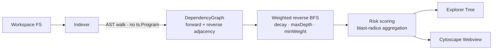

# VS Code Engineering Portfolio


> A working fork of [**microsoft/vscode**](https://github.com/microsoft/vscode) hosting two independent, production-grade engineering tracks:
> a **maintainer-friendly OSS contribution** to the VS Code integrated terminal, and **ImpactFlow** — an architectural impact-analysis VS Code extension built from scratch on the TypeScript compiler API.

The upstream Visual Studio Code README is preserved verbatim as [VSCODE_README.md](./VSCODE_README.md).


> *Above: the real ImpactFlow demo running. Purple diamond is the file being analyzed (`auth.ts`); red, orange, yellow, and blue nodes are downstream modules colored by computed risk level. This is exactly what ImpactFlow renders inside VS Code — [try the interactive version here](./demo/track2-impactflow.html).*

---

## The two problems, and what I built

### Problem 1 — The terminal has no safety net for destructive commands

VS Code's integrated terminal will run anything a task, an extension, a VS Code command, or an AI assistant hands it via the `sendText` API — including `rm -rf /`, `git reset --hard`, `docker system prune`, `dd of=/dev/sda`, or a pasted `curl | sh`. Once it's executed, it's gone. Users never had a chance to say *wait*.

**What I built — Track 1: Terminal Command Risk Preview.** A curated, reviewed library of regex rules that classify incoming commands across 8 destructive categories (filesystem, git, container, package, disk, permission, remote-code-execution, fork-bomb). When a programmatic submission matches a pattern, a confirmation dialog fires with the risk category and the exact matched substring. Cancel drops the command silently — no events fire, no process write happens.

**Design invariants that make it maintainer-mergeable:**

| Concern | Response |
|---|---|
| *Will this slow typing?* | The gate is on `ITerminalInstance.sendText` — user keystrokes never flow through it. When the setting is off, it's a single `getValue` lookup. |
| *Will this break existing tests?* | The only new dependency is `IDialogService`, already stubbed by `workbenchInstantiationService`. Zero existing test changes. |
| *Is it a giant diff?* | 711 insertions across 5 files, split into 3 independently-revertable commits. |
| *Is the detector reusable?* | Zero VS Code imports. Pure function, 100% unit-testable in isolation. |
| *Telemetry? AI?* | None. Regex rules, reviewed by hand. No network. |

**Live demo (no setup):** [`demo/track1-terminal-risk-preview.html`](./demo/track1-terminal-risk-preview.html)
**Source:** [`feature/terminal-risk-preview`](https://github.com/Srujan4812/vscode/tree/feature/terminal-risk-preview) — detector at [`terminalCommandRisk.ts`](https://github.com/Srujan4812/vscode/blob/feature/terminal-risk-preview/src/vs/workbench/contrib/terminal/common/terminalCommandRisk.ts) · integration at [`terminalInstance.ts`](https://github.com/Srujan4812/vscode/blob/feature/terminal-risk-preview/src/vs/workbench/contrib/terminal/browser/terminalInstance.ts#L1374) · design doc at [`docs/terminal-command-risk-preview.md`](./docs/terminal-command-risk-preview.md)

**Commit series:**
```
637358b7d14  terminal: gate sendText on command risk preview
4f9c3e79eff  terminal: register commandRiskPreview.enabled setting
cde14519a80  terminal: add command risk detector module
```

---

### Problem 2 — "If I change this file, what breaks?" has no tool for it

In any non-trivial TypeScript codebase, *Go to Definition* answers "what does this do?" but nothing in VS Code answers the question that actually matters before a refactor:

> **If I change this file, what else might break?**

Developers answer it by walking imports manually, running test suites and watching what fails, and grepping for symbols. Slow, incomplete, and unreliable on large codebases.

**What I built — Track 2: ImpactFlow.** A VS Code extension that indexes a TypeScript workspace with the TypeScript compiler API, builds a directed dependency graph with typed edges (runtime `import`, `reexport`, `dynamicImport`, `typeOnly`, `testOnly`), and answers impact queries with a **weighted reverse breadth-first search** with a geometric decay factor. Each reached module gets a risk score (fan-in centrality + propagation strength + hop penalty + hotspot-keyword match). The whole impact set aggregates into a single **blast-radius level** (low / medium / high / critical).

Results render into an Explorer tree grouped by risk level and an **interactive Cytoscape.js webview** — that's the graph shown in the screenshot above.

**Architecture:**



**Key engineering decisions (and what each one costs):**

| Decision | Why | Tradeoff |
|---|---|---|
| `ts.createSourceFile` per file, no `ts.Program` | Indexing stays O(files) instead of O(files × transitive-type-check) | External imports resolve to synthetic `external:<spec>` nodes instead of real paths |
| File-level graph, not symbol-level | Understandable UI, covers the 90% case | Function-level is on the roadmap for v0.2 |
| Weighted reverse BFS, not PageRank or flow analysis | Answers "what does *this specific module* affect?" — PageRank answers the wrong question | Not branch-conditional |
| Additive weighted sum for scoring (not multiplicative) | Each contributor is independently inspectable in the UI's "reasons" list | Slightly less dramatic on outliers |
| Cytoscape.js bundled offline | No network at render time; works fully offline | Adds ~200 KB; graceful fallback if missing |

**Live demo (no setup):** [`demo/track2-impactflow.html`](./demo/track2-impactflow.html)
**Source:** [`feature/impactflow`](https://github.com/Srujan4812/vscode/tree/feature/impactflow) · project root [`impactflow/`](https://github.com/Srujan4812/vscode/tree/feature/impactflow/impactflow) · full README [`impactflow/README.md`](https://github.com/Srujan4812/vscode/blob/feature/impactflow/impactflow/README.md)

**Scale:**

| Metric | Observed |
|---|---|
| Code | ~2.6k LOC of TypeScript, JS, CSS, tests, and a Mermaid README |
| Modules | 5 algorithmic core · 3 VS Code integration · 2 webview media · 2 test |
| Commits | 5 reviewable, per-layer |
| Runtime deps | `typescript` only |

---

## See it in 10 seconds (no setup)

Both demos are plain HTML pages that open in any browser:

- **[Track 1 demo — `track1-terminal-risk-preview.html`](./demo/track1-terminal-risk-preview.html)** — the real detector ported to browser JS. Type any command, or click a preset (`rm -rf /tmp`, `git reset --hard`, `curl | sh`, `fork bomb`), and the VS Code-styled confirmation dialog fires with the matched substring and risk category.
- **[Track 2 demo — `track2-impactflow.html`](./demo/track2-impactflow.html)** — the graph in the screenshot above, interactive. Pan, zoom, click nodes to focus them.

---

## How the repository is organized

```
.
├── README.md                       # This portfolio overview
├── VSCODE_README.md                # Original Microsoft VS Code README, preserved verbatim
├── docs/
│   └── terminal-command-risk-preview.md   # Track 1 design narrative (PR-ready)
├── demo/
│   ├── track1-terminal-risk-preview.html   # Interactive Track 1 demo
│   ├── track2-impactflow.html              # Interactive Track 2 demo
│   └── impactflow-screenshot.png           # The live graph featured above
├── impactflow/                     # Track 2 — standalone VS Code extension (on feature/impactflow)
├── src/                            # VS Code source tree (upstream + Track 1 additions on feature/terminal-risk-preview)
└── …                               # All other upstream VS Code content untouched
```

### Branch map

| Branch | Purpose | Status |
|---|---|---|
| `main` | Mirror of upstream | untouched |
| `feature/terminal-risk-preview` | **Track 1** — VS Code OSS contribution | ✅ pushed · 3 commits · 711 lines |
| `feature/impactflow` | **Track 2** — flagship extension | ✅ pushed · 5 commits · 2 661 lines |
| `portfolio/readme` | This README + docs + demos | ✅ pushed |

The two feature branches are independently reviewable. The portfolio branch exists purely so portfolio content never pollutes either feature branch's diff against upstream.

---

## Running the real features locally

Prerequisites: a working VS Code dev setup (Node 20, Python, build tools) per the [upstream contributing wiki](https://github.com/microsoft/vscode/wiki/How-to-Contribute).

**Track 1 — runs inside the VS Code dev build:**

```bash
git checkout feature/terminal-risk-preview
npm install
npm run watch            # leave running in one terminal
./scripts/code.sh        # or scripts\code.bat on Windows
```

Inside the dev build, turn the setting on (`"terminal.integrated.commandRiskPreview.enabled": true`) and trigger a programmatic command submission — for example a task that runs `rm -rf /tmp/example`, or an extension that calls `terminal.sendText`. The confirmation dialog fires.

**Track 2 — runs as a standalone extension:**

```bash
git checkout feature/impactflow
cd impactflow
npm install
npm run compile
code .                   # then press F5 to launch an Extension Development Host
```

In the extension dev host, open any TypeScript workspace and run *ImpactFlow: Analyze Current File*. First index takes 1–2 seconds on a 1k-file project; the tree view and graph webview populate immediately.

---

## What this fork is *not*

- Not a rewrite of VS Code.
- Not a proposal to land an experimental AI feature upstream.
- Not a dumping ground for junk commits or auto-generated scaffolding — every module has a deliberate doc-comment header, every design decision has a stated tradeoff, every commit message explains *why*.

The point is to show the *thought process* behind engineering decisions at this scale: where to intercept, what to leave alone, which algorithm actually answers the question, and how to package the result so that a maintainer — or a reviewer — can evaluate it quickly.

---

## License

- Upstream VS Code content remains under its original MIT license ([LICENSE.txt](./LICENSE.txt)).
- The ImpactFlow extension is MIT-licensed independently ([`impactflow/LICENSE`](https://github.com/Srujan4812/vscode/blob/feature/impactflow/impactflow/LICENSE)).
