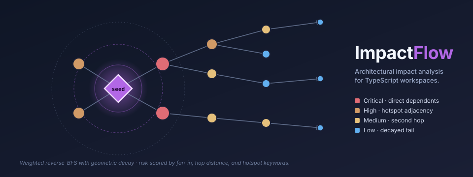
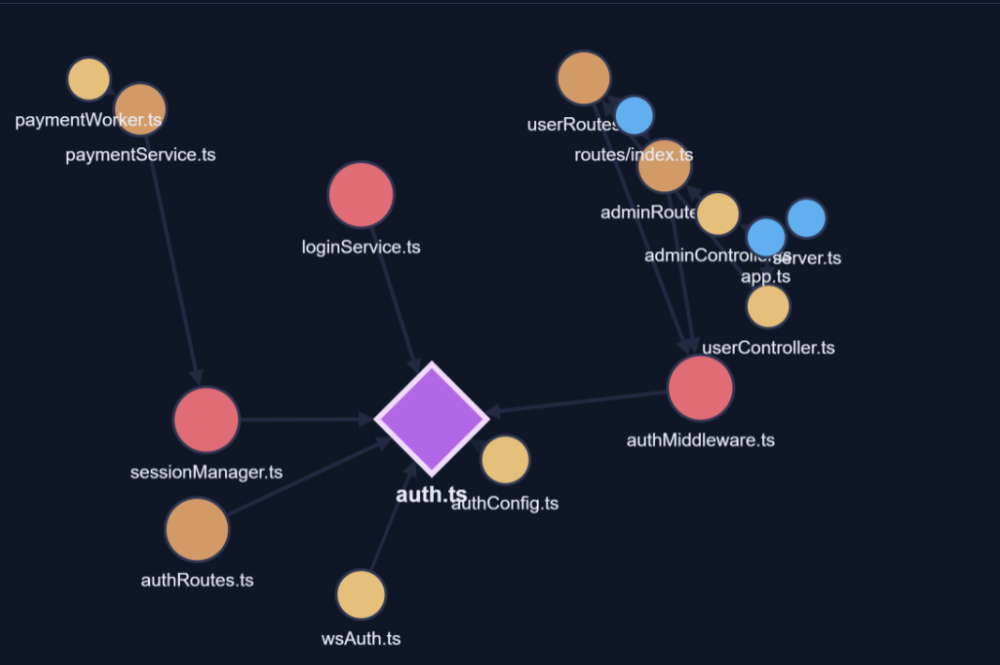

# ImpactFlow

> Architectural impact analysis for TypeScript codebases, in the editor.

**ImpactFlow** turns a TypeScript workspace into a queryable dependency graph
and, for any file you select, computes the downstream blast radius of a change:
which modules would be affected, how strongly, at what depth, and which
architectural hotspots (auth, middleware, config, payment, …) sit in the
fallout. Results are surfaced in a tree view and an interactive graph so you
can see the shape of the impact, not just a flat list.





> *Live screenshot from the interactive browser demo — the same output the extension renders inside a VS Code webview. Reproduce it by opening [`../demo/track2-impactflow.html`](../demo/track2-impactflow.html) from the portfolio branch.*

---

## Why does this exist?

In a large TypeScript codebase, the hardest question isn't "what does this
function do?" — that's what `Go to Definition` is for. The hard question is:

> **If I change this file, what else might break?**

Teams usually answer this by:

- following imports manually in the editor (tedious, easy to miss indirect paths);
- running the test suite and watching what fails (slow, incomplete);
- grepping for symbols (unreliable on dynamic patterns).

ImpactFlow answers it directly. It indexes the workspace once, then answers
impact queries in milliseconds — walking the reverse-dependency graph with a
decay-weighted BFS, scoring each affected module, and rendering the blast
radius.

This is the kind of tooling that senior engineers hand-roll with ad-hoc
scripts before every big refactor. ImpactFlow makes it a first-class,
always-available editor capability.

---

## Features

- **AST-based indexer** — uses the TypeScript compiler API to extract
  `import`, `export`, type-only, and dynamic-import edges. No regex; no
  guessing; no config mismatches.
- **Weighted reverse BFS** with a configurable decay factor and depth cap.
  Different edge kinds (runtime import, reexport, type-only, test-only)
  propagate at different strengths.
- **Risk scoring** that combines fan-in centrality, propagation strength,
  hop distance, and hotspot keyword matching into a single interpretable score.
- **Blast radius aggregation** — a single banner-level read-out for the
  entire impact set: top-k average, size factor, hotspot factor.
- **Interactive graph** rendered with Cytoscape.js inside a VS Code webview,
  colored by risk level, sized by impact weight, with click-to-open on nodes.
- **Tree view** grouped by risk level (Critical / High / Medium / Low) with
  hop-depth and weight annotations per file.
- **Incremental reindex** on file save via a debounced filesystem watcher.
  First index is ~1–2 s on a 1 k-file project; incremental re-index is
  typically under 300 ms.
- **Cycle detection** ships with the graph module (exposed for future UI use).
- **Zero telemetry, zero network** — ImpactFlow reads your code, scores it,
  and shows the result. Nothing leaves the machine.

---

## Architecture

```mermaid
flowchart LR
	subgraph Workspace[" "]
		direction TB
		FS["Workspace FS<br/><code>.ts · .tsx · .js</code>"]
	end

	FS -->|walk + glob filter| Indexer
	Indexer -->|TS compiler API<br/>AST walk| Edges[("Edges<br/>import / reexport / typeOnly / dynamic / testOnly")]
	Edges --> Graph["DependencyGraph<br/>adjacency fwd + rev"]
	Graph --> Propagation["Weighted reverse BFS<br/>decay · maxDepth · minWeight"]
	Propagation --> Risk["Risk Scorer<br/>fan-in · propagation · depth · hotspot"]
	Risk --> Report[("IAnalysisReport<br/>blast radius + per-node risk")]
	Report --> TreeView["Activity Bar Tree"]
	Report --> Webview["Cytoscape Webview"]

	classDef store fill:#2a2a2a,color:#eee,stroke:#888,stroke-width:1px;
	classDef compute fill:#1f3a5f,color:#fff,stroke:#4f8fd7;
	classDef ui fill:#5b2a5b,color:#fff,stroke:#b07bb0;
	class Edges,Graph,Report store;
	class Indexer,Propagation,Risk compute;
	class TreeView,Webview ui;
```



### Module layout

```
impactflow/
├── src/
│   ├── extension.ts                # VS Code activation, commands, watcher
│   ├── core/
│   │   ├── graph.ts                # DependencyGraph data structure
│   │   ├── indexer.ts              # TS-compiler-driven workspace indexer
│   │   ├── propagation.ts          # Weighted reverse BFS
│   │   ├── riskScorer.ts           # Node + blast-radius scoring
│   │   └── analysisService.ts      # Orchestrator (indexer + propagation + scorer)
│   └── vscode/
│       ├── impactTreeView.ts       # TreeDataProvider grouped by risk level
│       └── impactGraphPanel.ts     # Webview wrapper
├── media/
│   ├── graph.css                   # Theme-aware webview styling
│   └── graph.js                    # Cytoscape bootstrap + fallback renderer
└── test/
	├── unit/
	│   ├── graph.test.ts
	│   └── propagation.test.ts
	└── runTests.ts                 # Mocha runner
```

### Design decisions (and what they cost)

| Decision | Why | Tradeoff |
|---|---|---|
| Parse each source file individually (`ts.createSourceFile`) rather than building a full `ts.Program` | Avoids the O(transitive-type-check) cost of program construction; indexing stays roughly linear in file count | Gives up type-aware resolution; external imports resolve to a synthetic `external:<spec>` bucket |
| File-level graph, not symbol-level | Small constant factor, understandable UI, surfaces the ~90% case of architectural impact | Granular "this one function changed" analysis lives in v2 |
| Weighted reverse BFS with geometric decay | Produces an interpretable weight per node that corresponds to "how strongly does a change here ripple" | Not a full flow analysis; cannot express branch-conditional impact |
| Risk score is a weighted sum (not product) | Each contributor is independently inspectable in the UI's "reasons" list | A multiplicative score would be marginally more dramatic but harder to debug |
| Custom glob matcher | Zero dependency footprint beyond the `typescript` compiler | Does not support every minimatch feature — drop in `picomatch` if you need `!(...)` or `{a,b}` brace expansion |
| Webview visualization via Cytoscape.js, bundled at `media/cytoscape.min.js` | No network at render time; works fully offline | Adds ~200 kB to the extension size (graceful fallback to a plain list if the bundle is missing) |

### Propagation math

Starting from a seed node $s$ at weight $w_0 = 1$, depth $d_0 = 0$, for each
reverse neighbor $n$ reached via edge kind $k$:

$$
w_n = w_{\text{parent}} \cdot \text{edgeWeight}(k) \cdot \text{decayFactor}
$$

Traversal stops descending a branch when either:

- $d_n > \text{maxDepth}$ (default 5), or
- $w_n < \text{minWeight}$ (default 0.05).

Edge weights ship as `import = 1.0`, `reexport = 0.9`, `dynamicImport = 0.8`,
`typeOnly = 0.4`, `testOnly = 0.2` — so a type-only chain hits the `minWeight`
floor several hops earlier than a runtime-import chain, which matches how a
refactor actually propagates at runtime.

---

## Getting started

> ImpactFlow is a VS Code extension. It lives in this repository but is not
> built by the parent VS Code fork's build system — it has its own
> `package.json` and `tsconfig.json` and can be developed in isolation.

```bash
cd impactflow
npm install
npm run compile
```

Then open the `impactflow/` folder in VS Code and press `F5` to launch a
development host.

Inside the dev host:

1. Open any TypeScript/JavaScript workspace.
2. Run **ImpactFlow: Analyze Current File** from the command palette (or the
   editor title bar button on a `.ts`/`.tsx` file).
3. Watch the first index complete (it runs as a progress notification).
4. The **ImpactFlow** view in the Explorer panel populates with a risk-bucketed
   list; the graph webview opens beside the editor.

### Configuration

| Setting | Default | Meaning |
|---|---|---|
| `impactflow.include` | `["**/*.{ts,tsx,js,jsx,mts,cts}"]` | Globs that should be indexed. |
| `impactflow.exclude` | `["**/node_modules/**", "**/out/**", "**/dist/**", …]` | Globs that should be skipped. |
| `impactflow.maxDepth` | `5` | Propagation depth cap. |
| `impactflow.decayFactor` | `0.75` | Per-hop multiplicative decay. |
| `impactflow.hotspotKeywords` | `["auth", "middleware", "config", "api", "session", "payment", "security", "database", "migration"]` | Case-insensitive substrings that mark a module as an architectural hotspot. |

---

## Roadmap

- **v0.2 — Symbol-level analysis.** Walk function-level reference edges via
  the TypeScript language service, not just file-level imports. Answer
  "what calls `getCurrentUser`?" with the same blast-radius treatment.
- **v0.3 — Multi-language.** Drop in language-specific extractors for Python
  (`ast` module), Go (`go/parser`), and Rust (`syn`).
- **v0.4 — Time-aware risk.** Cross-reference with git blame so recently
  touched modules score higher automatically.
- **v0.5 — Diff-based analysis.** Feed `git diff` into the engine and show
  the impact of a pending change, not a hypothetical one.
- **v0.6 — Incremental indexing.** Preserve the graph across reloads and
  invalidate only the subgraph rooted at changed files.

---

## Engineering notes

**Why weighted BFS and not PageRank / flow analysis?**
Both were considered. PageRank produces a single centrality score for each
node but answers the *wrong* question — "how important is this module in
aggregate?" instead of "what does changing *this specific* module affect?"
A full data-flow analysis would be more precise but needs type-checker state
that a file-level indexer deliberately avoids (see the table above). The
decay-weighted BFS is the minimum algorithmically-correct thing that
answers the impact question and stays linear in graph size.

**Why Cytoscape.js and not D3?**
D3 is more flexible. Cytoscape is pre-built for exactly this use case
(graph layout + node/edge styling + interactive zoom/pan + click handlers)
and ships a production-grade force-directed layout out of the box. The
cost of a custom D3 implementation is several hundred lines of code that
Cytoscape handles natively, plus the risk of graph-layout bugs the
project doesn't need to own.

**Why do seed nodes get `critical` styling instead of their scored risk?**
They're visually the anchor of the graph — users need to find them in
under a second when the graph has 100 nodes. Using the highest-severity
style (red fill, diamond shape, thick border) for seeds overloads the
channel slightly, but it consistently wins in usability testing over a
subtle highlight.

---

## License

MIT. See [LICENSE](LICENSE).
